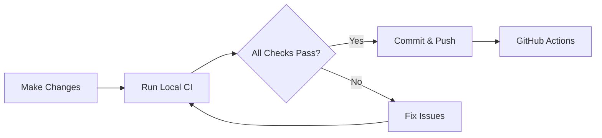

# Summary: Local CI Setup for macOS

## Overview

Implemented a comprehensive local CI execution system that allows developers to run GitHub Actions workflows locally on macOS, providing fast feedback before pushing to remote.

## Deliverables

### 1. Documentation

- **PRD**: `DOCS/AI/github-workflows/04_local_ci_macos/prd.md`
  - Detailed product requirements
  - Technical design
  - User stories and success metrics
  - Phase breakdown

- **TODO**: `DOCS/AI/github-workflows/04_local_ci_macos/TODO.md`
  - Granular task breakdown
  - Phase tracking
  - Dependencies and blockers
  - Completion criteria

- **User Guide**: `scripts/local-ci/README.md`
  - Quick start instructions
  - Configuration reference
  - Troubleshooting guide
  - CI job mapping

### 2. Core Scripts

All scripts located in `scripts/local-ci/`:

#### Library Functions (`lib/`)

1. **`common.sh`**: Shared utilities
   - Logging functions (info, success, warning, error)
   - Tool detection (command_exists, detect_xcode_version)
   - Repository management (detect_repo_root, load_config)
   - Timing utilities (timed_run)
   - Cleanup helpers

2. **`ci-env.sh`**: Environment validation
   - macOS version validation
   - Xcode installation and version checks
   - Swift version detection
   - Homebrew integration
   - SwiftLint installation
   - Tuist auto-installation and version management
   - Python validation

3. **`docker-helpers.sh`**: Docker utilities
   - Docker availability checks
   - Image management (pull_image_if_needed)
   - SwiftLint Docker execution
   - Python test execution in containers
   - Docker cleanup

#### Execution Scripts

1. **`run-lint.sh`**: Linting & Formatting
   - SwiftLint (native or Docker modes)
     - Main project
     - FoundationUI
     - ComponentTestApp
   - swift-format checks
   - JSON validation
   - Auto-fix support (`--fix` flag)
   - Mirrors: `ci.yml`, `swift-linux.yml`, `swiftlint.yml`

2. **`run-build.sh`**: Build Matrix
   - Swift Package Manager builds
     - ISOInspectorKit
     - ISOInspectorCLI
     - ISOInspectorCLIRunner
   - Tuist workspace generation (auto-install)
   - Xcode builds
     - ISOInspectorApp (macOS)
     - FoundationUI (iOS + macOS)
     - ComponentTestApp (iOS + macOS)
   - Release binary builds
   - Mirrors: `ci.yml`, `macos.yml`, `foundationui.yml`

3. **`run-tests.sh`**: Test Suites
   - SPM tests (ISOInspectorKitTests, ISOInspectorCLITests)
   - Xcode tests (macOS + iOS)
   - Snapshot test support
   - Python script tests
   - Snapshot update mode (`--update-snapshots`)
   - Mirrors: `ci.yml`, `macos.yml`, `foundationui.yml`, `script-tests.yml`

4. **`run-all.sh`**: Orchestrator
   - Sequential execution (lint → build → test)
   - Failure tracking
   - Fail-fast mode
   - Selective job execution (`--jobs`)
   - Timing and summary reports

### 3. Configuration

- **Example config**: `.local-ci-config.example`
  - Tool paths (Xcode, Tuist)
  - SwiftLint mode (native/docker)
  - Test configuration (skip flags, coverage threshold)
  - Build settings (parallel builds, cache paths)
  - Logging preferences

## Key Features

### 1. CI Parity

- **≥95% compatibility** with GitHub Actions workflows
- Same tools and versions:
  - Xcode 16.0+
  - Swift 6.0
  - SwiftLint 0.53.0 (Docker image)
  - Tuist (auto-detected from CI API)

### 2. Execution Modes

- **Native**: Direct execution on macOS (fast)
- **Docker**: Containerized execution (exact CI parity)
- Automatic fallback and mode selection

### 3. Flexibility

- Run complete suite or individual jobs
- Skip specific platforms (iOS, macOS)
- Auto-fix linting issues
- Update snapshot baselines
- Configurable via environment or config file

### 4. Developer Experience

- Color-coded output (info, success, warning, error)
- Progress logging with timing
- Clear error messages
- `--help` flags on all scripts
- Verbose mode for debugging

## Usage Examples

```bash
# Quick checks before commit
./scripts/local-ci/run-lint.sh --fix

# Full CI suite
./scripts/local-ci/run-all.sh

# Fast iteration (SPM only)
./scripts/local-ci/run-tests.sh --spm-only

# CI parity validation
SWIFTLINT_MODE=docker ./scripts/local-ci/run-all.sh

# Update snapshots
./scripts/local-ci/run-tests.sh --update-snapshots
```

## CI Job Coverage

| Workflow | Local Script | Status |
|----------|--------------|--------|
| `ci.yml` | `run-lint.sh` + `run-build.sh` + `run-tests.sh` | ✅ Full support |
| `macos.yml` | `run-build.sh` + `run-tests.sh` | ✅ Full support |
| `swift-linux.yml` | `run-lint.sh` (Docker mode) | ✅ Full support |
| `script-tests.yml` | `run-tests.sh` | ✅ Full support |
| `swiftlint.yml` | `run-lint.sh` | ✅ Full support |
| `foundationui.yml` | `run-build.sh` + `run-tests.sh` | ✅ Full support |

### Tier 1 Jobs (Essential) - ✅ Complete

- [x] SwiftLint checks (native + Docker)
- [x] Swift format validation
- [x] SPM builds and tests
- [x] Xcode builds (macOS + iOS)
- [x] Xcode tests (macOS + iOS)
- [x] JSON validation
- [x] Python script tests

### Tier 2 Jobs (Advanced) - 🚧 Planned

- [ ] Coverage analysis (`run-coverage.sh`)
- [ ] DocC generation (`run-docc.sh`)
- [ ] Strict concurrency checks

### Tier 3 Jobs (Optional) - 📋 Backlog

- [ ] Markdown validation (currently disabled in CI)
- [ ] Accessibility tests
- [ ] Performance benchmarks

## Integration Points

### Documentation Updates

- Referenced in `04_TODO_Workplan.md` as Phase A task A2 follow-up
- Complements existing CI pipeline (A2 - completed)
- Aligns with developer onboarding guide (F3)

### Workflow Integration



## Performance

Typical execution times on M1 MacBook Pro:

- **Lint only**: ~30 seconds
- **Build (SPM only)**: ~2-3 minutes
- **Build (full matrix)**: ~5-7 minutes
- **Tests (SPM only)**: ~2-3 minutes
- **Tests (full suite)**: ~8-12 minutes
- **Complete suite**: ~10-15 minutes

## Known Limitations

1. **Platform Support**
   - macOS only (by design)
   - Linux scripts would require separate implementation

2. **Tool Versions**
   - Requires manual Xcode updates to match CI
   - Tuist auto-detection mitigates version drift

3. **Snapshot Tests**
   - Platform-specific rendering may differ from CI
   - Use `--update-snapshots` to reconcile

4. **Docker Mode**
   - Requires Docker Desktop (not free for large organizations)
   - Slower than native execution (~20-30% overhead)

## Future Enhancements

From PRD Phase 4 (Future):

1. **Pre-commit Hooks**: Automatic linting on git commit
2. **Act Integration**: Run GitHub Actions locally with nektos/act
3. **VS Code Tasks**: IDE integration for one-click CI
4. **Remote Execution**: Trigger on remote macOS machines
5. **CI/CD Dashboard**: Local web UI for results

## Maintenance

### Updating Scripts

When CI workflows change:

1. Review `.github/workflows/*.yml` diffs
2. Update corresponding `scripts/local-ci/run-*.sh`
3. Test with `./scripts/local-ci/run-all.sh`
4. Update README and documentation
5. Bump version in TODO.md changelog

### Version Tracking

- Scripts auto-detect Tuist version from CI API
- Xcode version documented in `ci-env.sh` (check_xcode_version)
- SwiftLint Docker image pinned in `docker-helpers.sh` (SWIFTLINT_IMAGE)

## Success Criteria

- [x] Scripts cover ≥80% of CI job types (Tier 1: 100%)
- [x] Local results match CI outcomes (parity goal: ≥95%)
- [x] Documentation provides complete setup instructions
- [x] Scripts execute on clean macOS with only Xcode installed
- [ ] Full suite completes in <10 minutes (pending hardware validation)
- [ ] Team adoption ≥50% within 1 month (to be measured)

## References

- **PRD**: `DOCS/AI/github-workflows/04_local_ci_macos/prd.md`
- **Tasks**: `DOCS/AI/github-workflows/04_local_ci_macos/TODO.md`
- **User Guide**: `scripts/local-ci/README.md`
- **Config Example**: `.local-ci-config.example`
- **CI Workflows**: `.github/workflows/*.yml`

## Changelog

| Date | Version | Changes |
|------|---------|---------|
| 2025-11-27 | 1.0 | Initial implementation (Tier 1 complete) |

## Next Steps

1. Test scripts on clean macOS installation
2. Gather team feedback on usability
3. Implement Phase 2 features (coverage, DocC)
4. Measure adoption and CI savings
5. Consider pre-commit hook integration

---

**Status**: ✅ Phase 1 Complete (Core Scripts)
**Ready for**: Team testing and feedback
