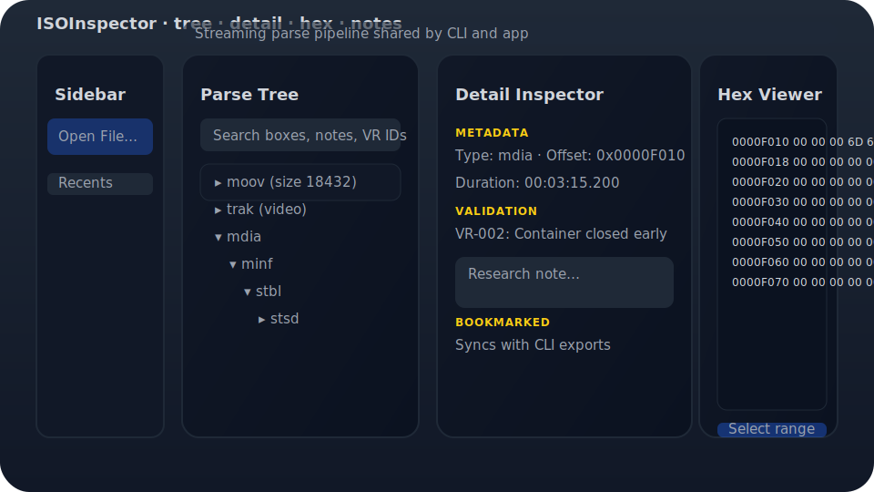

# ISOInspector

Monorepo for the ISOInspector suite: a Swift-based ISO Base Media File Format (MP4/QuickTime) parser, CLI, and multiplatform SwiftUI application. The repository follows the execution guidance documented in `DOCS/AI` and the XP-inspired TDD workflow defined in `DOCS/RULES/02_TDD_XP_Workflow.md`.

## Feature Matrix

| Surface | Highlights | Automation hooks |
| --- | --- | --- |
| **ISOInspectorKit** | Streaming `ParsePipeline.live()` surfaces MP4 boxes with metadata, validation, and research logging for callers in any platform target.【F:Documentation/ISOInspector.docc/Guides/DeveloperOnboarding.md†L60-L76】【F:Sources/ISOInspectorKit/ISO/ParsePipeline.swift†L90-L132】 | Exporters emit JSON trees and binary captures while `ResearchLogWriter` records VR-006 diagnostics for downstream tooling.【F:Documentation/ISOInspector.docc/Guides/DeveloperOnboarding.md†L60-L76】【F:Sources/ISOInspectorKit/Export/JSONParseTreeExporter.swift†L1-L52】【F:Sources/ISOInspectorKit/Validation/ResearchLogWriter.swift†L19-L60】 |
| **ISOInspectorApp** | SwiftUI workspace combines streaming tree, detail inspector, notes, and hex panes with bookmark syncing across launches.【F:Documentation/ISOInspector.docc/Manuals/App.md†L1-L114】 | Restores sessions, bookmarks, and notes through Core Data while resolving security-scoped bookmarks for sandboxed distribution builds.【F:Documentation/ISOInspector.docc/Manuals/App.md†L69-L110】【F:Documentation/ISOInspector.docc/Manuals/App.md†L115-L149】 |
| **`isoinspect` CLI** | Shared parsers stream validation summaries and box events with commands for inspect, validate, export, and batch workflows.【F:Documentation/ISOInspector.docc/Manuals/CLI.md†L1-L83】【F:Documentation/ISOInspector.docc/Manuals/CLI.md†L96-L165】 | Global flags toggle verbose output, telemetry, and sandbox-friendly bookmark automation so jobs can run unattended with captured research logs and MP4RA refresh tooling.【F:Documentation/ISOInspector.docc/Manuals/CLI.md†L11-L63】【F:Documentation/ISOInspector.docc/Manuals/CLI.md†L66-L141】【F:Documentation/ISOInspector.docc/Manuals/CLI.md†L182-L229】 |

## Supported Platforms & Box Families

- **Platforms:** macOS 14 and iOS/iPadOS 16 or newer targets are available through SwiftPM products for the app and kit.【F:Documentation/ISOInspector.docc/Manuals/App.md†L7-L18】【F:Package.swift†L6-L44】
- **File types:** MP4 (`.mp4`) and QuickTime (`.mov`) containers stream through the document picker and CLI readers.【F:Documentation/ISOInspector.docc/Manuals/App.md†L9-L34】【F:Documentation/ISOInspector.docc/Manuals/CLI.md†L1-L52】
- **Container boxes:** `FourCharContainerCode` centralises movie, track, metadata, and streaming container identifiers for traversal utilities.【F:Sources/ISOInspectorKit/ISO/FourCharContainerCode.swift†L1-L46】
- **Media/index boxes:** `MediaAndIndexBoxCode` captures frequently referenced payload and streaming indicator boxes for validation heuristics.【F:Sources/ISOInspectorKit/ISO/MediaAndIndexBoxCode.swift†L1-L43】

## Interface Preview



The overview illustrates the tri-pane layout documented in the app manual so readers can map README highlights to the live SwiftUI workflow.【F:Documentation/ISOInspector.docc/Manuals/App.md†L33-L114】

## Package Layout
- `Sources/ISOInspectorKit` — Core parsing and validation library (currently scaffolded).
- `Sources/ISOInspectorCLI` — Command-line interface with a custom bootstrap runner.
- `Sources/ISOInspectorApp` — SwiftUI application shell for macOS/iPadOS/iOS.
- `Tests/*` — XCTest suites for the library, CLI surface, and app composition.
- `Docs` — Living documentation (architecture notes, guides, manuals).
- `Sources/*/*.docc` — DocC catalogs for the kit, CLI, and SwiftUI app.

## Getting Started
1. Install Swift 6.0.1 or newer.
2. Build all targets:
   ```sh
   swift build
   ```
3. Run the test suite:
   ```sh
   swift test
   ```

## Git Hooks

Enable the repository-managed hooks to automatically format Markdown documentation and validate YAML files before each commit:

```sh
git config core.hooksPath .githooks
```

The pre-commit hook requires Docker (recommended), or a local `swiftlint` binary, plus `npx`, `python3`, and [`PyYAML`](https://pyyaml.org/). It runs:

```sh
scripts/swiftlint-format.sh   # falls back to local `swiftlint --fix` if Docker is missing
npx markdownlint-cli2 --fix 'DOCS/INPROGRESS/**/*.md' 'DOCS/COMMANDS/**/*.md' 'DOCS/RULES/**/*.md'
scripts/check_yaml.py         # requires PyYAML (`python3 -m pip install pyyaml`)
```

Re-run the command if your local configuration resets `core.hooksPath`.

Validate YAML files ad-hoc with:

```sh
scripts/check_yaml.py path/to/workflow.yml another/config.yaml
```

## Documentation

Generate browsable DocC archives for every target with:

```sh
scripts/generate_documentation.sh
```

The script produces static-hostable archives under `Documentation/DocC/<Target>` and can be
shared via GitHub Pages or other artifact storage.

## Continuous Integration

The repository ships with two GitHub Actions workflows that cover the primary
targets:

- **Swift (Linux)** runs SwiftLint, builds all products, executes the test
  suite with coverage enabled, and prints a summary report.
- **macOS Build** selects the latest stable Xcode toolchain, archives the
  unsigned `ISOInspectorApp`, and publishes a release `isoinspect` CLI binary.

Reproduce the automated checks locally with:

```sh
# Apply SwiftLint fixes via the same container image used in CI
scripts/swiftlint-format.sh

# Verify lint (requires Docker; mirrors the CI verify step)
docker run --rm -u "$(id -u):$(id -g)" -v "$PWD:/work" -w /work ghcr.io/realm/swiftlint:0.53.0 \
  swiftlint lint --strict --no-cache --config .swiftlint.yml

# Build and test with coverage
swift test --enable-code-coverage
```

## Container Code Enumeration

ISOInspectorKit now exposes a `FourCharContainerCode` enum that centralises the set of four-character container box identifiers
(`moov`, `trak`, `mdia`, and others). Use the enum when checking for child-bearing boxes instead of hard-coded string literals; it
provides helpers such as `isContainer(_:)` for `FourCharCode`, `String`, and `BoxHeader` values and powers traversal logic in
`StreamingBoxWalker`. Adding new containers only requires extending the enum in `Sources/ISOInspectorKit/ISO/FourCharContainerCode.swift`.

## Media & Index Box Enumeration

Companion enum `MediaAndIndexBoxCode` tracks frequently referenced structural boxes such as `mdat`, `sidx`, and `styp`. The type
offers the same conversion helpers as the container enum, plus convenience sets for streaming indicators and media payloads.
Ordering rules and streaming heuristics rely on these helpers to avoid scattered string literals; extend
`Sources/ISOInspectorKit/ISO/MediaAndIndexBoxCode.swift` when additional structural boxes gain first-class support.

## Fixture Catalog & Deterministic Samples

Regression coverage now includes a deterministic fixture catalog stored in
`Tests/ISOInspectorKitTests/Fixtures`. Synthetic streaming, malformed, and
large-payload MP4 assets are generated locally via
`Tests/ISOInspectorKitTests/Fixtures/generate_fixtures.py` and committed as
base64-encoded `.txt` files to keep provenance auditable while avoiding binary
artifacts in git history. Tests in
`Tests/ISOInspectorKitTests/FixtureCatalogExpandedCoverageTests.swift` validate
expected box layouts and documented warnings so future fixture refreshes stay in
sync with the catalog metadata.

## MP4RA Catalog Maintenance
The repository maintains a pinned snapshot of the MP4 Registration Authority box catalog in `Sources/ISOInspectorKit/Resources/MP4RABoxes.json`.
To update the snapshot and keep CI green:

1. Download the latest catalog JSON from the MP4RA source and overwrite `Sources/ISOInspectorKit/Resources/MP4RABoxes.json`.
2. Run the minimal validator locally before committing:
   ```sh
   python scripts/validate_mp4ra_minimal.py Sources/ISOInspectorKit/Resources/MP4RABoxes.json
   ```
   The script also defaults to this path when invoked without arguments.
   A `Validation OK` message indicates the file matches the required structure and formatting (two-space indentation, LF
   newlines, valid identifiers, etc.).
3. Commit the refreshed snapshot together with any fixes required by the validator. The GitHub Actions workflow
   (`validate-mp4ra-minimal.yml`) executes the same script on pull requests and pushes to `main` to enforce consistency.

## Next Steps
Consult `DOCS/AI/ISOViewer/ISOInspector_PRD_TODO.md` for feature-level deliverables and `DOCS/AI/ISOInspector_Execution_Guide/04_TODO_Workplan.md` for task sequencing. Begin by enhancing the IO foundations described in Phase A.
